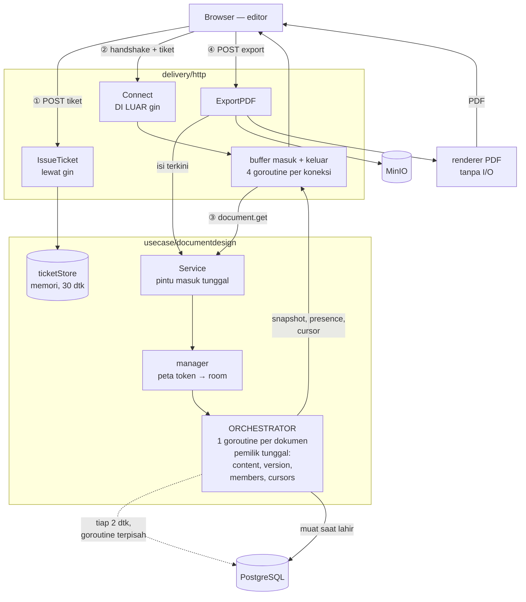
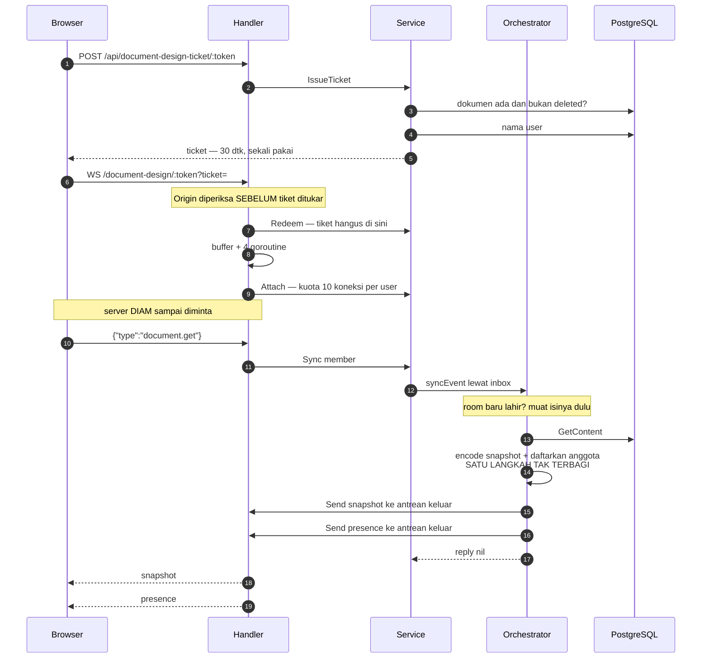
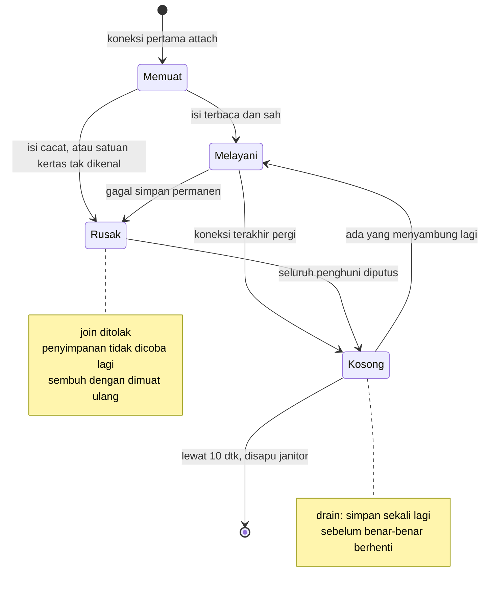
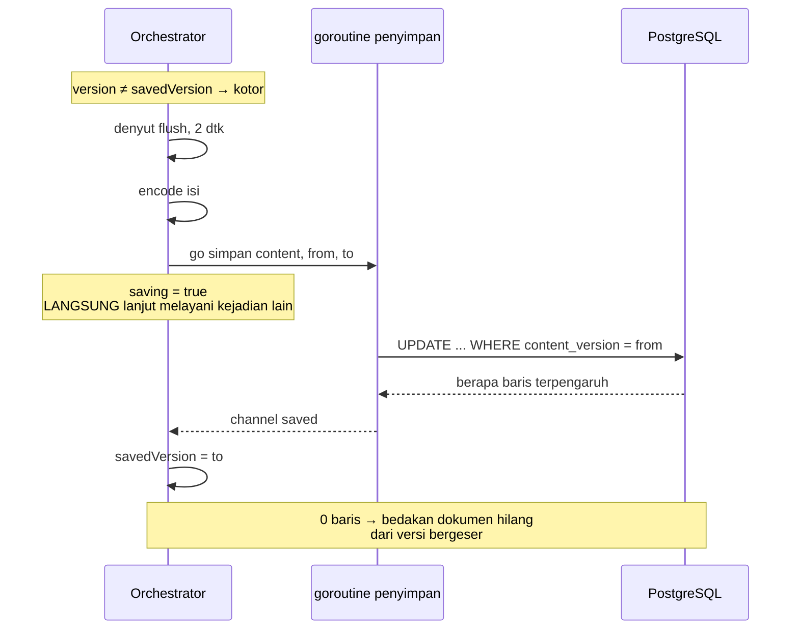
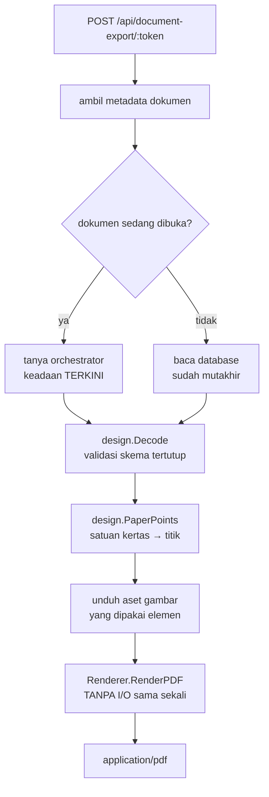

# Arsitektur Document Design

Bagaimana fitur ini bekerja di backend, dari permintaan tiket sampai berkas PDF
keluar.

Dokumen ini untuk orang yang akan **mengubah** kodenya. Ia menjelaskan
keputusan, invarian, dan model kegagalan — hal-hal yang tidak dapat dibaca
kembali dari kode. Bentuk pesan dan cara memakainya dari frontend ada di
[`websocket-contract.md`](websocket-contract.md) dan
[`document-design.md`](document-design.md), dan sengaja tidak diulang di sini.

---

## Gambaran menyeluruh



Empat jalur masuk, satu pemilik state. Semua yang menyentuh isi satu dokumen —
penyuntingan, snapshot, ekspor, penyimpanan — melewati orchestrator dokumen itu.

---

## Peta lapisan

```
delivery/http
  document_design_handler.go    handshake, empat goroutine per koneksi
  document_design_conn.go       keempat loop, dispatch pesan masuk
  document_design_edit.go       pesan element.* dan page.* → Service
  document_design_subscriber.go implementasi port Subscriber
  document_design_encoder.go    implementasi port MessageEncoder
  document_design_buffer.go     antrean masuk/keluar per klien (sync.Cond)
  document_export_handler.go    POST /api/document-export/:token
  dto/document_design_dto.go    bentuk kawat seluruh pesan
        │
        ▼  port: MessageEncoder, Subscriber
usecase/documentdesign
  service.go                    pintu masuk tunggal; tiket, attach, sync, edit
  manager.go                    peta token → room, masa tenggang, sapu bersih
  room.go                       ORCHESTRATOR — pemilik tunggal state dokumen
  event.go                      himpunan tertutup kejadian menuju orchestrator
  edit.go                       penerapan perubahan elemen dan halaman + siarannya
  history.go                    riwayat undo/redo satu dokumen, di memori room
  presence.go                   daftar orang yang sedang membuka dokumen
  cursor.go                     denyut dan siaran kursor
  persist.go                    flush berkala, drain saat berhenti
  ticket.go                     tiket sekali pakai, kuota per user
  connections.go                kuota koneksi per user
  content.go                    benih panduan untuk dokumen kosong
usecase/document_export_usecase.go   rakit isi + gambar + font → renderer
        │
        ▼  port: DocumentRepository, DocumentRenderer, FontCatalog, ObjectStorage
domain/design                   model isi dokumen: tipe, validasi, satuan, font
  edit.go                       operasi penyuntingan elemen dan halaman, batas MaxPages
infrastructure/pdf              renderer PDF, registry font, penyandian cp1252
persistence/postgres            baca/tulis kolom content dengan compare-and-set
```

Arah ketergantungan selalu ke bawah. `domain/design` tidak mengimpor apa pun
dari lapisan di atasnya, dan `documentdesign` tidak mengenal WebSocket, HTTP,
maupun gin — ia hanya tahu ada `Subscriber` yang bisa dikirimi byte.

---

## 1. Hulu ke hilir

Dari klik "buka dokumen" sampai snapshot tergambar:



Perhatikan langkah 15: pendaftaran anggota dan penyandian snapshot terjadi dalam
satu langkah yang tidak dapat disela. Itulah yang membuat mustahil ada siaran
menyalip snapshot yang jadi dasarnya.

### 1.1 Tiket

```
POST /api/document-design-ticket/:token   (lewat gin, AuthRequired)
  → Service.IssueTicket
      periksa token berbentuk UUID
      periksa dokumen ada dan bukan deleted     ← query
      ambil nama user                            ← query
      ticketStore.issue                          ← memori, TTL 30 detik
```

Dua query di sini disengaja. Penerbitan tiket terjadi sekali per sesi dan sudah
menyentuh database, sedangkan jalur WebSocket setelahnya harus tetap **bebas
query** — itulah alasan nama pengguna ikut dititipkan ke dalam tiket alih-alih
dicari saat koneksi terbuka.

### 1.2 Handshake

```
GET /document-design/{token}?ticket=…      ← DI LUAR gin, lewat http.ServeMux
  → websocket.Accept                        periksa Origin, tolak 403 sebelum upgrade
  → Service.Redeem                          tiket hangus di sini
  → conn.SetReadLimit(1 MB)
  → newDesignBuffer(64)
  → tiga goroutine: read, write, ping
  → Service.Attach                          kuota 10 koneksi per user
  → dispatchLoop                            di goroutine handler ini sendiri
```

**Origin diperiksa sebelum tiket ditukar.** Urutan itu penting: permintaan lintas
situs tertahan tanpa pernah menghanguskan tiket yang sah.

**Tiket ditukar setelah upgrade.** Juga disengaja — browser tidak dapat membaca
status HTTP dari handshake WebSocket yang gagal, sedangkan `CloseEvent.reason`
terbaca. Menolak tiket sebagai close frame `1008` adalah satu-satunya cara
frontend tahu ia perlu menerbitkan tiket baru.

### 1.3 Satu koneksi: empat goroutine

```
                    ┌──────────────────── satu koneksi ────────────────────┐
                    │                                                       │
   socket ─────────►│ readLoop ──► [antrean masuk 256] ──► dispatchLoop ────┼──► Service
                    │     │              sync.Cond                          │       │
                    │     │ satu-satunya yang menunggu context              │       ▼
                    │     │                                                 │  ORCHESTRATOR
                    │     ▼ buffer.close() membangunkan dua yang lain       │       │
   socket ◄─────────│ writeLoop ◄─ [antrean keluar 256] ◄──────────────────┼───────┘
                    │              sync.Cond            Send() cuma menaruh │
                    │ pingLoop     denyut 30 dtk, tenggang pong 10 dtk      │
                    └───────────────────────────────────────────────────────┘
```

Antrean masuk penuh berarti klien mengirim lebih cepat daripada kemampuan
memproses — koneksinya diakhiri, bukan antreannya ditumbuhkan. Antrean keluar
penuh berarti klien tertinggal terlalu jauh — hasilnya sama.

`readLoop` memikul tanggung jawab menghentikan yang lain: hanya ia yang menunggu
dengan context, jadi hanya ia yang tahu aplikasi sedang berhenti. `buffer.close()`
miliknya yang membangunkan penulis dan dispatcher dari `cond.Wait()`. **Bila
tanggung jawab itu dipindah, shutdown akan menggantung.**

Dispatcher dipisah dari pembaca supaya pembacaan socket tidak ikut tertahan saat
pemrosesan sedang menunggu antrean orchestrator.

### 1.4 Room dan orchestrator

`manager` memegang peta `token → roomEntry` di bawah satu mutex. Pencarian,
pembuatan, dan penambahan pencacah terjadi di bawah satu penguncian — memecahnya
jadi "periksa" lalu "buat" akan membuat dua koneksi yang datang bersamaan pada
dokumen yang sama menghasilkan **dua room dengan state bercabang**.

Room hidup lebih lama daripada koneksi mana pun:



Masa tenggang itu menutup kasus yang paling sering terjadi — muat ulang halaman
dan wifi yang berkedip. Tanpanya setiap refresh berarti room dibongkar, dibangun
ulang, dan isinya dibaca ulang dari database.

### 1.5 Persistensi tunda

Orchestrator tidak menulis ke database di dalam dirinya sendiri:



Menulis di dalam orchestrator akan menghentikan seluruh penyuntingan dokumen itu
selama query berlangsung. Paling banyak satu penulisan berjalan per room;
perubahan yang masuk selama penulisan otomatis membuat `version` melewati versi
yang sedang ditulis, sehingga room tetap kotor dan ikut tertulis pada denyut
berikutnya.

Kerugian maksimal saat proses mati mendadak adalah **satu denyut flush**, selalu.

### 1.6 Ekspor



Ekspor **wajib** lewat room bila dokumennya sedang dibuka. Penyimpanan tertunda
sampai dua detik, jadi membaca database pada dokumen yang sedang disunting dapat
menghasilkan PDF yang tertinggal beberapa suntingan dari yang dilihat pengguna.

Renderer sengaja tidak melakukan I/O: gambar sudah diambil pemanggil dan
diserahkan sebagai byte. Dengan begitu ia tidak pernah dapat diarahkan mengambil
alamat yang ditentukan klien lewat isi dokumen.

---

## 2. Kenapa orchestrator, bukan mutex

Seluruh state satu dokumen — isi, versi, versi tersimpan, daftar anggota, letak
kursor, status rusak — dimiliki **satu goroutine**, dan diubah hanya lewat antrean kejadian.

Yang didapat dari situ:

**Urutan penerapan adalah urutan antrean, bukan hasil undian penjadwal.** Dengan
mutex, dua penyuntingan yang datang bersamaan diterapkan dalam urutan yang
ditentukan siapa yang menang berebut kunci. Dengan antrean, urutannya pasti dan
dapat ditelusuri di log.

**Pendaftaran anggota dan pengiriman snapshot terjadi dalam satu langkah tak
terbagi.** Itulah yang membuat mustahil ada siaran perubahan yang menyalip
snapshot yang menjadi dasarnya. Dengan mutex, celah antara "masuk daftar" dan
"terima snapshot" harus ditutup dengan penguncian yang lebih lebar — dan
penguncian lebar itu justru yang akan menahan I/O.

**Tidak ada kunci yang dipegang saat memanggil kode lapisan lain.** `Subscriber`
milik lapisan delivery; memanggilnya sambil memegang kunci berarti satu klien
lambat dapat membekukan seluruh dokumen.

Ongkosnya: setiap operasi sinkron membayar satu perjalanan pulang-pergi channel.
Terukur sekitar **105 µs pada p50**, dan tetap di bawah satu milidetik pada p99
bahkan ketika ekspor membanjiri orchestrator yang sama.

### 2.1 Di mana antrean terjadi

Dengan lima klien pada satu dokumen, dan salah satunya mengirim `document.get`:

```
klien A     readLoop A      dispatchLoop A        ORCHESTRATOR        writeLoop A
   │            │                 │                     │                  │
   ├ document.get►                │                     │                  │
   │            ├ enqueue masuk ──► cond.Signal         │                  │
   │            │  [mutex antrean] │                     │                  │
   │            │                 ├ manager.mu ┐        │                  │
   │            │                 │ cari room  │        │                  │
   │            │                 │◄───────────┘        │                  │
   │            │                 ├ inbox <- event ────►│  ①               │
   │            │                 ├ tunggu reply ──────►│  ②  ◄── DI SINI  │
   │            │                 │                     ├ encode snapshot  │
   │            │                 │                     ├ Send ───────────►│ enqueue
   │            │                 │                     ├ presence ───────►│ enqueue
   │            │                 │◄─── reply ──────────┤                  │
   │            │                 │                     │                  ├ Write socket
   │◄───────────┴─────────────────┴─────────────────────┴──────────────────┘
```

| Titik tunggu | Berapa lama | Siapa yang ikut terkena |
|---|---|---|
| Mutex antrean masuk | beberapa instruksi | hanya A |
| `manager.mu` | satu pencarian peta | semua dokumen — tapi nanodetik |
| ① `r.inbox <- event` | hanya bila 64 kejadian sudah mengantre | hanya A |
| ② **menunggu `reply`** | sampai orchestrator sampai giliran A | A menunggu, klien lain mengantre di belakangnya |
| Enqueue ke antrean keluar | beberapa instruksi | — |
| `conn.Write` ke socket | I/O sungguhan | hanya A, di goroutine A sendiri |

**Hanya ② yang berarti.** Dan ia tidak seburuk kelihatannya, karena orchestrator
tidak pernah melakukan I/O — `Send` cuma menaruh ke antrean lalu kembali. Klien
yang jaringannya lambat tidak menahan siapa pun.

Dua tempat yang benar-benar dapat menggigit:

**Penyandian snapshot tumbuh bersama ukuran dokumen.** Dokumen 12 KB memakan
puluhan mikrodetik; satu megabita memakan milidetik, dan permintaan yang
bersamaan mengalikannya karena semuanya berurutan.

**Pemuatan pertama menahan semua orang.** `run()` memanggil `load()` **sebelum**
mulai melayani inbox, jadi kelima klien menunggu satu pembacaan database itu —
sampai `contentLoadTimeout`. Disengaja, karena tanpanya lima koneksi yang datang
bersamaan menghasilkan lima query untuk dokumen yang sama. Konsekuensinya:
snapshot pertama secepat database, bukan secepat orchestrator.

---

## 3. Invarian yang tidak boleh dilanggar

Melanggar satu pun dari ini menghasilkan kerusakan yang tidak menimbulkan galat
kompilasi maupun pesan kesalahan.

**1. Field state Room hanya disentuh `run()`.** Tidak ada mutex di `Room`, dan
memang tidak boleh ditambahkan — kepemilikan tunggal itulah jaminannya. Menambah
mutex berarti mengakui ada akses dari luar, dan sejak saat itu seluruh alasan
memilih orchestrator gugur.

**2. `Subscriber.Send` tidak boleh memblokir.** Orchestrator memanggilnya sambil
memiliki state room. Implementasi yang menunggu I/O akan menghentikan seluruh
penyuntingan dokumen itu hanya karena satu klien lambat.

**3. `Disconnect` tidak boleh melakukan I/O.** Alasan yang sama. Ia hanya mencatat
alasan lalu menutup buffer; close frame dikirim belakangan oleh goroutine
handler, selagi koneksi masih utuh.

**4. Penyimpanan memakai `context.WithoutCancel`.** Baik pada flush berkala maupun
pada drain. Membiarkannya ikut dibatalkan berarti setiap shutdown membuang
suntingan terakhir — persis pekerjaan yang drain diadakan untuk menyelamatkan.

**5. Inbox tidak pernah ditutup.** Menutupnya membuat pengirim panik. Sebagai
gantinya orchestrator menutup `done` saat keluar, dan setiap pengirim
menjadikannya jalan keluar.

**6. `hasUser` diperiksa sebelum anggota didaftarkan.** Yang menentukan
perlu-tidaknya siaran kehadiran adalah apakah **orangnya** sudah hadir, bukan
koneksinya. Memeriksanya setelah pendaftaran selalu menghasilkan "sudah hadir".

**7. Kursor memakai `SendEphemeral`, tidak pernah `Send`.** `Send` mengakhiri
koneksi ketika antrean keluar penuh, dan itu benar untuk snapshot maupun
presence: klien yang kehilangan salah satunya akan salah selamanya. Untuk kursor
itu keliru — jeda GC atau satu render berat sudah cukup untuk menjatuhkan sesi
orang yang sedang bekerja, demi pesan yang sudah basi satu denyut kemudian.

**8. Penggabungan mengganti DI TEMPAT, bukan memindahkan ke belakang.**
`designQueue.conflate` menimpa isi isian yang kuncinya sama tanpa menggesernya,
sehingga urutan pesan itu terhadap jenis pesan lain tetap seperti saat ia pertama
masuk. Memindahkannya ke ekor akan membuat kursor menyalip snapshot atau
presence yang datang lebih dulu.

**9. Perubahan elemen: terapkan → naikkan `version` → siarkan, selalu bertiga.**
Menaikkan `version` tanpa menyiarkan membuat klien melihat celah nomor dan memuat
ulang seluruh dokumen tanpa sebab. Menyiarkan tanpa menaikkannya membuat dua
perubahan berbeda mengaku sebagai revisi yang sama, dan deteksi celah di frontend
berhenti bekerja. Perubahan yang **tidak berlaku** — sasarannya sudah lenyap —
tidak melakukan ketiganya.

**10. Siaran perubahan memakai `Send`, bukan `SendEphemeral`.** Kebalikan dari
invarian 7, dan alasannya persis kebalikannya juga: kursor yang hilang tidak
merugikan siapa pun, sedangkan perubahan yang hilang membuat kanvas klien salah
selamanya tanpa ada yang tahu. Klien yang tidak sanggup mengikuti diputus, dan
`document.get` sesudahnya menghasilkan keadaan yang benar.

**11. Pengirim perubahan IKUT menerima siarannya sendiri.** Juga kebalikan dari
kursor. Melewatinya membuat nomor `version` miliknya tertinggal setiap kali ia
menyunting, lalu siaran pertama dari orang lain tampak melompat dan ia memuat
ulang tanpa sebab — makin rajin ia bekerja, makin sering itu terjadi.

**12. `consume()` mendahului `drain()` pada jalur berhenti.** Kejadian yang masih
mengantre diterapkan sebelum penyimpanan terakhir. Membaliknya membuang suntingan
yang sudah diterima klien sebagai berhasil. Di dalam `consume`, `syncEvent`
sengaja **ditolak** alih-alih diterapkan: menerimanya menjadikan seseorang anggota
room yang sedang mati, dan ia tidak akan pernah tahu.

**13. Dokumen selalu punya minimal satu halaman.** `design.DeletePage` menolak
halaman terakhir. Melonggarkannya tidak menghasilkan galat apa pun pada saat
penghapusan — kerusakannya muncul belakangan, ketika `Room.load` menganggap
dokumen tanpa halaman sebagai dokumen kosong dan menimpanya dengan panduan
bawaan. Yang melihatnya adalah orang berikutnya yang membuka dokumen, dan ia
tidak akan punya cara menghubungkannya dengan penghapusan itu.

**14. `design.VisiblePages` adalah satu-satunya definisi "terlihat".** Ekspor
memakainya untuk dua hal yang harus sepakat: menggambar halaman, dan menentukan
aset mana yang diunduh. Menyaring sendiri-sendiri di kedua tempat akan berakhir
dengan salah satunya lupa — dan gejalanya adalah halaman tersembunyi berisi
gambar rusak yang menggagalkan ekspor dokumen yang sebenarnya baik-baik saja,
karena kegagalan mengunduh satu aset membatalkan seluruh ekspor.

Penyaringan juga terjadi **sebelum** penjaga dokumen kosong di `renderer.go`,
bukan di dalam perulangan gambar. Bila dibalik, dokumen yang seluruh halamannya
tersembunyi lolos penjaga itu dan menghasilkan PDF tanpa halaman sama sekali,
yang bukan berkas sah.

**15. Pengelompokan langkah undo memisahkan yang diskret dari yang mengalir.**
Menggabungkan semata-mata berdasarkan jeda pernah dicoba dan salah: `lastChangeAt`
bergeser pada setiap perubahan, sehingga langkah baru hanya lahir setelah dokumen
sunyi total — dan pada dokumen yang dipakai bersama, kesunyian itu tidak pernah
datang. Terukur waktu itu: dua orang yang masing-masing menyunting tiap 1,2 detik,
keduanya merasa santai, menghasilkan SATU langkah untuk dua belas tindakan, karena
suntingan mereka berselang-seling di bawah satu detik.

Yang berdiri sendiri — create, delete, reorder — tidak pernah digabungkan.
Yang mengalir dibatasi dua kali: oleh jeda, dan oleh lama kelompoknya.

**16. Cuplikan riwayat diambil SEBELUM perubahan, disimpan SESUDAH terbukti
berlaku.** Mengambilnya sesudah berarti yang tersimpan keadaan yang sudah
berubah, sehingga undo tidak mengembalikan apa pun. Menyimpannya tanpa memeriksa
`applied` berarti perubahan yang sasarannya sudah lenyap tetap meninggalkan
langkah undo — dan langkah itu, bila ditekan, tidak melakukan apa-apa. Keduanya
gagal diam-diam.

**17. Setiap field bertipe rujukan pada `Element` wajib disalin sendiri di
`design.Content.Clone`.** Dulu invarian ini berbunyi "jangan pernah menambahkan
tipe rujukan", dan itu bertahan sampai `opacity` membutuhkannya: nol adalah
ketembusan yang sah, sehingga ia tidak dapat memakai nilai nol sebagai penanda
"tidak disebutkan" seperti field lain, dan pointer menjadi satu-satunya jalan.

`copy` pada slice elemen menyalin nilai field satu per satu, sehingga pointer
berakhir menunjuk objek yang sama dengan aslinya. `Clone` karena itu menyalin
`Opacity` secara eksplisit, dan setiap field rujukan berikutnya harus ikut
disalin di sana.

Melewatkannya tidak menghasilkan galat apa pun. Cuplikan undo hanya akan
diam-diam ikut berubah bersama isi yang hidup, dan Ctrl+Z mengembalikan keadaan
yang sudah tidak ada lagi.

**18. Urutan kunci: `manager.mu` lebih dulu, dan tidak pernah ditahan saat
menunggu channel.** `manager.sync` dan `manager.snapshot` melepas kunci sebelum
bertanya ke room. Menahannya akan membekukan seluruh dokumen lain.

---

## 4. Anggaran goroutine

| | Jumlah | Umur |
|---|---|---|
| Per koneksi | **4** — read, write, ping, dispatch | selama socket hidup |
| Per room | **1** orchestrator | sampai masa tenggang habis |
| Per penyimpanan | 1, sementara | satu query |
| Global | 1 janitor | seumur aplikasi |

Satu dokumen dengan lima klien: 5 × 4 + 1 = **21 goroutine**, ditambah satu
goroutine penyimpan yang datang dan pergi tiap dua detik.

Yang mendominasi memori adalah **isi dokumen itu sendiri**, dipegang sekali per
room — bukan per koneksi. Sisanya kecil dan tetap: dua antrean berkapasitas 64
pointer per koneksi, dan satu antrean 16384 kejadian per room — **256 KB**,
karena channel mengalokasikan seluruh slotnya di muka. Angka terakhir itu yang
naik paling cepat bila banyak dokumen dibuka serentak.

Verifikasi kebocoran dilakukan dengan membandingkan jumlah goroutine sebelum dan
sesudah beban, setelah memberi orchestrator waktu menuntaskan drain-nya.

---

## 5. Model kegagalan

| Yang terjadi | Perilaku backend | Yang dilihat pengguna |
|---|---|---|
| Isi di database cacat | room ditandai rusak saat memuat | `error` `document_unavailable`; room dibuang setelah masa tenggang lalu dimuat ulang |
| Satuan kertas tidak dikenal | room ditandai rusak saat memuat | sama seperti di atas |
| Dokumen dihapus orang lain | `SaveContent` → `ErrNotFound`, permanen | close `1011` beserta alasannya |
| Versi bergeser (ada penulis lain) | `ErrConflict`, permanen | close `1011` |
| Database tersendat sesaat | kegagalan sementara, tetap kotor, coba lagi 2 detik lagi | tidak terlihat |
| Klien tertinggal > 256 pesan | koneksinya dibatalkan | putus, sambung ulang biasa |
| Aplikasi berhenti | drain: tunggu penulisan berjalan, simpan sekali lagi | putus; suntingan terakhir tersimpan |
| Font tidak terdaftar | ekspor gagal | `400` menyebut nama fontnya |
| Aset gambar terhapus | elemen dilewati | PDF tanpa gambar itu — sama dengan layar |

Kegagalan penyimpanan **permanen** diperlakukan dengan memutus klien, bukan
memuat ulang diam-diam. Keduanya sama-sama membuang delta yang belum tersimpan,
tetapi memutus lebih jujur: menimpa penulis lain jauh lebih berbahaya daripada
memaksa klien menyambung ulang dan melihat keadaan yang sebenarnya.

---

## 6. Tetapan waktu dan ketergantungannya

| Tetapan | Nilai | Kenapa segitu |
|---|---|---|
| `TicketTTL` | 30 dtk | cukup untuk satu handshake, tidak cukup untuk disimpan dan dipakai ulang |
| `maxTicketsPerUser` | 5 | menahan penerbitan berulang tanpa mengunci orang yang membuka banyak tab |
| `maxConnectionsPerUser` | 10 | tiket habis dipakai, jadi kuota tiket **tidak** membatasi koneksi |
| `designMaxMessageBytes` | 1 MB | satu klien tidak dapat memaksa alokasi sebesar apa pun |
| `designQueueLimit` | 256 | menakar tersendat, bukan laju: klien yang sungguh lebih lambat daripada arus perubahan tidak akan menyusul berapa pun antreannya. Dinaikkan dari 64 ketika penyuntingan masuk, karena siaran perubahan memakai Send yang memutus koneksi saat penuh |
| `designPingInterval` + `designPongTimeout` | 30 + 10 dtk | koneksi mati terdeteksi paling lambat 40 detik |
| `designWriteTimeout` | 5 dtk | penulisan memakai context yang lepas dari pembatalan, jadi butuh batasnya sendiri |
| `roomInboxSize` | 16384 | kelonggaran bagi lonjakan kursor; pengirim yang tertahan di sini berujung pada koneksi klien yang diakhiri. **256 KB per room** dialokasikan di muka, plus ~768 KB bila sungguh terisi penuh |
| `flushInterval` | 2 dtk | kerugian maksimal saat proses mati mendadak |
| `contentLoadTimeout` | 5 dtk | |
| `contentSaveTimeout` | 3 dtk | lebih dari cukup untuk memperbarui satu baris |
| `cursorTickInterval` | 70 ms | laju siaran kursor terikat pada denyut ini, berapa pun derasnya masukan. Terukur **pada denyut 50 ms**: 521 gerakan dalam 3 detik menjadi 61 pesan, latensi p99 45 ms — angkanya berskala dengan denyut |
| `historyCoalesceWindow` | 400 ms | jeda yang mengakhiri satu aliran perubahan. Hanya mengatur element.update dan page.update — yang berdiri sendiri tidak pernah digabungkan |
| `historyGroupMaxSpan` | 2 dtk | batas lama satu langkah undo. Jeda saja tidak cukup: aliran yang tidak pernah berhenti tidak pernah berjeda |
| `roomIdleGrace` | 10 dtk | menutup refresh halaman dan wifi berkedip |
| `janitorInterval` | 5 dtk | **harus lebih kecil** dari `roomIdleGrace`, kalau tidak sampah bertahan hampir dua kali lipat |

Tiga di antaranya saling bergantung, dan mengubah satu tanpa yang lain akan
membuang suntingan terakhir pengguna:

```
drainSaveWait  = contentSaveTimeout + 1 dtk  = 4 dtk
roomStopTimeout ≥ drainSaveWait + contentSaveTimeout = 7 dtk   → dipatok 8 dtk
```

`drainSaveWait` **wajib lebih panjang** daripada `contentSaveTimeout`. Bila
keduanya disamakan, timer dapat menang tipis dan drain menyerah tepat sebelum
hasil penulisan datang — lalu keluar tanpa pernah mencoba penyimpanan terakhir.

`roomStopTimeout` harus menutupi kasus terburuk satu room saat drain: menunggu
penulisan yang sedang berjalan, lalu menyimpan sekali lagi.

---

## 7. Pelajaran yang mahal

Empat hal yang menghabiskan waktu untuk ditemukan dan tidak terbaca dari kode.

**gin v1.11 menolak Hijack begitu response tersentuh.** `coder/websocket` menulis
status 101 lewat `ResponseWriter` lalu memanggil `WriteHeaderNow()` untuk gin,
dan sejak v1.11 itu membuat `Written()` bernilai true sehingga Hijack ditolak.
Gejalanya jahat: handshake tampak berhasil dari sisi klien, tetapi server tidak
pernah memegang koneksinya. **Karena itu handshake dilayani di luar gin lewat
`http.ServeMux`.**

**Close frame harus dikirim sebelum context dibatalkan.** `coder/websocket`
menutup socket seketika ketika context pembacaan dibatalkan, jadi membatalkan
lebih dulu berarti alasan penutupan tidak pernah sampai ke klien.

**Penulisan ke socket butuh context yang lepas dari pembatalan.** `readLoop`
membatalkan context sebelum menutup buffer, sehingga pesan yang masih mengantre
tidak akan pernah terkirim bila penulisan ikut memakai context itu.

**Font inti PDF tidak membawa metrik vertikal, dan memakai Windows-1252.** fpdf
hanya menyimpan lebar glif untuk font inti; ascent dan descent Helvetica harus
dituliskan dari berkas AFM Adobe. Dan menyerahkan byte UTF-8 apa adanya membuat
tanda pisah `—` tercetak sebagai `â€"`, tanpa satu pun galat.

---

## 8. Yang belum ada, dan kenapa

**Penyalinan halaman.** Halaman baru selalu kosong. Menduplikasi halaman berikut
isinya butuh penurunan id elemen yang baru, dan bentuk pesannya belum
diputuskan.

**Batas jumlah elemen.** Halaman dibatasi 200 karena tiap halaman menjadi satu
halaman PDF yang digambar dari nol saat ekspor. Elemen sengaja tidak dibatasi.
Konsekuensinya satu halaman dapat menampung elemen sebanyak apa pun, dan yang
membatasi hanya ukuran satu pesan — bukan penumpukannya. Bila ada dokumen yang
terasa berat saat ekspor, di sinilah tempat pertama melihat.

**Riwayat perubahan.** Backend tidak menyimpan siaran yang sudah lewat dan tidak
dapat mengirim ulang yang terlewat. Klien yang melihat celah `version` memuat
ulang seluruh dokumen. Itu memadai selama dokumen berukuran puluhan elemen, dan
akan terasa mahal bila tidak lagi begitu.

**Riwayat versi dokumen.** Undo/redo di `history.go` hidup di memori room dan
mati bersamanya — sepuluh detik setelah penyunting terakhir pergi. Ia tidak dapat
mengembalikan keadaan kemarin, dan tidak pernah menyentuh database. Dokumen yang
dirusak lalu ditinggalkan tetap tidak punya jalan pulang; `documents.parent_id`
masih menunggu dipakai untuk itu.

**Kabar keadaan riwayat.** Tidak ada pesan yang memberitahu klien apakah masih
ada yang dapat di-undo, sehingga tombolnya tidak dapat dimatikan pada saat yang
tepat. Menekan undo pada riwayat kosong aman dan tidak menghasilkan apa-apa.

**Kunci elemen saat digeser.** Tidak ada penanda "elemen ini sedang dipegang si
A". Menang-terakhir sudah menyelesaikan kasusnya tanpa keadaan tambahan yang
harus dibersihkan ketika orang putus koneksi mendadak. Ini berbeda dari field
`locked`, yang permanen dan disimpan bersama dokumen.

**Penegakan `locked`.** Backend menyimpan dan menyiarkannya, tetapi tidak menolak
satu pun penyuntingan atas halaman maupun elemen terkunci. Menegakkannya berarti
menambah jalur penolakan pada jalur penyuntingan yang paling ramai, dan bentuk
yang benar bila nanti diperlukan adalah mendiamkan — seperti sasaran yang lenyap
— bukan membalas, supaya `element.update` tetap tanpa balasan.

**Grup sebagai keadaan yang dijaga.** `groupId` datar dan tidak berarti apa-apa
bagi backend: anggota satu grup tidak dijamin bersebelahan dalam urutan gambar,
menggeser grup adalah N perubahan terpisah dan bukan satu langkah tak terbagi,
dan grup di dalam grup butuh pohon yang belum diputuskan.

**`cursor.hide`.** Kursor orang yang menggeser pointer keluar kanvas baru hilang
ketika ia menutup tab atau pergi. Fondasinya sudah ada — tinggal satu jenis
kejadian yang menghapus satu entri peta.

**Kepemilikan dokumen.** Siapa pun yang berhasil login dapat membuka dan
mengekspor dokumen mana pun, cukup dengan mengetahui tokennya. Konsisten dengan
seluruh endpoint document lain di aplikasi ini, tetapi ini yang pertama perlu
ditutup begitu dokumen berisi data pelanggan sungguhan.

**Multi-instance.** Room ada di memori proses, jadi dua instance akan memegang
dua salinan dokumen yang sama dan saling menimpa lewat compare-and-set. Aplikasi
ini memang sudah dibatasi satu instance karena session refresh token juga di
memori.

**Batas jumlah halaman dan elemen.** Isi yang datang dari database tidak melewati
batas 1 MB yang berlaku untuk pesan masuk. Dokumen dengan sepuluh ribu elemen
akan dimuat apa adanya, dan ekspornya akan lambat.
